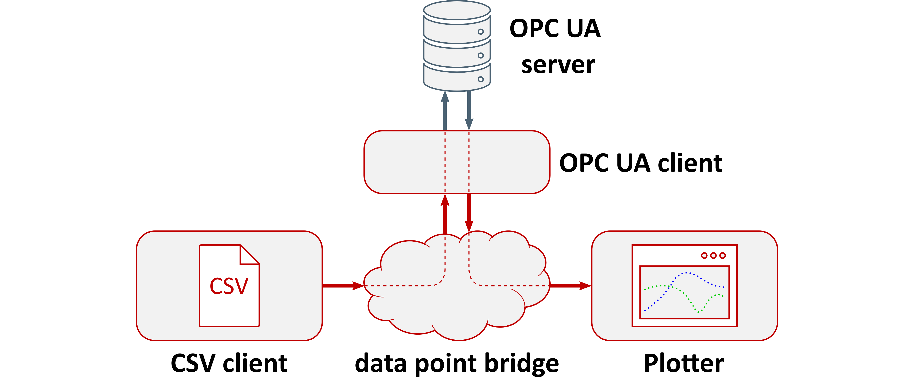

# Lablink Setup for OPC UA Client Test



This project contains a Lablink setup for connecting an OPC UA server with a data source and a plotter:
 * A [CSV client](https://ait-lablink.readthedocs.io/projects/ait-lablink-csv-client) acts as a data source, reading CSV data and sending it to the [OPC UA client](https://ait-lablink.readthedocs.io/projects/ait-lablink-opc-ua-client).
 * The [OPC UA client](https://ait-lablink.readthedocs.io/projects/ait-lablink-opc-ua-client) is connected to a OPC UA server, and has 2 purposes:
   1. Whenever new input data arrives, the client updates the values of the associated variables on the server
   2. At the same time, the client is subscribed to certain variables on the server. Whenever they change their values, it sends these values to the [plotter](https://ait-lablink.readthedocs.io/projects/ait-lablink-plotter).
 * The [plotter](https://ait-lablink.readthedocs.io/projects/ait-lablink-plotter) displays all incoming data on the screen.

**NOTE**:
In this specific example, the variables that are updated by the UPC UA client and the variables it listens to are identical.
In a real-world setup this would not make a lot of sense, but it is good enough for the purpose of this example.

**NOTE**:
All following instructions are for **Windows**, using either the [command prompt](https://en.wikipedia.org/wiki/Cmd.exe) (``cmd.exe``) or by double-clicking batch scripts (files of type ``*.cmd``).
Running the setup on **Linux** works analogously, using the correspondig commands from a command shell.

## Prerequisites

You need to have the following software installed for running this setup:
 * **Java Development Kit**:
   for instance the [Oracle Java SE Development Kit 13](https://www.oracle.com/technetwork/java/javase/downloads/index.html) or the [OpenJDK](https://openjdk.java.net/)
 * **MQTT broker**:
   for instance [Eclipse Mosquitto](https://mosquitto.org/) or [EMQ](http://emqtt.io/)
 * **Python**:
   tested with [Python 3.8.5](https://www.python.org/downloads/release/python-385/)

Make sure that the ``JAVA_HOME`` environment variable is set and points to your JDK installation:
  * open the system properties (``WinKey`` + ``Pause`` or go to *Settings* &#8594 *System* => *About* => *System Info* => *Advanced System Settings*)
  * select the *Advanced* tab, then the *Environment Variables* button
  * select and edit the ``JAVA_HOME`` variable in the user variables, e.g., adding *C:\\Program Files\\Java\\jdk-13.0.2*.

## Installation

### Lablink packages download

All required Lablink packages are listed as dependencies in file ``pom.xml`` (a [Maven](https://maven.apache.org/ project configuration file).
To download all required Lablink packages, open the command prompt, change to the project's root directory and type:
```batch
  mvnw package
```

### OPC UA server installation

This setup uses a simple OPC UA server, implemented using the [FreeOpcUa Python library](https://freeopcua.github.io/).
To install all required Python dependencies, open the command prompt, change to the project subdirectory ``setup\\1_opcua_server`` and type:
```batch
  pip install -r requirements.txt
```

## Running the test

### Step 1: Starting the OPC UA server

To start the OPC UA server, open the command prompt, change to the project subdirectory ``setup\\1_opcua_server`` and type:
```batch
  python test-opcua-server.py
```

### Step 2: Starting the Lablink config server

The configuration for all Lablink clients (incl. the CSV data for the CSV client) is contained in file ``setup\\2_lablink_config\\opcua-client-test-config.db``.
To start the Lablink config server, simply **double-click batch script** ``setup\\2_lablink_config\\run_config.cmd``.
Alternatively, you can open a new command prompt, change to the project subdirectory ``setup\\2_lablink_config`` and type:

**NOTE**:
Once the server is running, you can view the available configurations in a web browser via [http://localhost:10101](http://localhost:10101).

**NOTE**:
A convenient tool for viewing the content of the database file (and editing it for experimenting with the setup) is [DB Browser for SQLite](https://sqlitebrowser.org/).

### Running the Lablink clients

All batch scripts for running the Lablink clients can be found in project subdirectory ``setup\\3_run_test``:

 * **OPC UA client**: ``opcua-client.cmd``
 * **CSV client**: ``csv-client.cmd``
 * **Plotter**: ``plot.cmd``
 * **Data point bridge**: ``dpb.cmd``

To start the Lablink clients, simply **double-click** the corresponding **batch scripts**.
Alternatively, you can open a new command prompt for each, change to the project subdirectory ``setup\\3_run_test`` and type the script name.

**NOTE**:
You can start the Lablink clients in arbitrary order.

### Results

After running the clients for some time, the plotter output should look similar to this:


